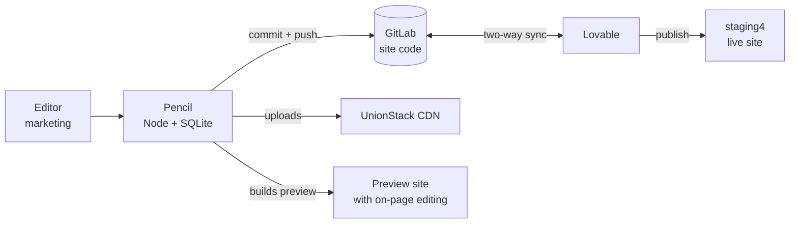

# Pencil: what it is and what hosting it needs

23 September 2026

## What Pencil is

Pencil lets a marketing person change the words and pictures on our website by clicking them on the page,
without going back to Lovable or to a developer. It is a small Node service that reads our site's source
code, shows every editable string as a field, and when someone publishes, writes the new text back into the
source files, commits it and pushes to GitLab. The code stays the source of truth: there is no parallel
content database the site reads at runtime, so nothing breaks if Pencil is down, and the design and
animations are untouched.

It is written and working. What we need now is a place to host it.

## How the pieces fit

Five systems, and only one of them is ours to host.

| Piece | What it is | Who runs it |
| --- | --- | --- |
| Site code | TanStack Start + React, 46 routes | GitLab, `gitlab.com/sourav.suman/masters-union-website-dev` |
| Lovable | Where the site was built; two-way sync with that repo | Lovable |
| Live site | `staging4.mastersunion.org`, updates when someone presses Update in Lovable | Lovable (custom domain) |
| Pencil | The CMS: API, studio, on-page editor, git sync, AI writer | Us, needs hosting |
| Pictures | `files.unionstack.in`, our own CDN | UnionStack |

Pencil's own code is at `github.com/vinaynain26/mu-console`, branch `main`. It is one Node program containing
both the API and its UI, plus a SQLite file for data: there is no separate frontend or backend to deploy.

## What already works

All of this is running on a laptop today, against the real GitLab repo and the real CDN.

- **Reading the site**: 46 pages and 8,452 editable fields scanned straight from the source code. Field keys
  are hashes of the text, not positions, so edits survive Lovable reshuffling the code.
- **Editing on the page**: click any text or picture on the preview, type in place, save as a draft, publish.
- **Publishing**: writes the text into the source files and pushes to GitLab. Verified end to end: commit
  `67c01e6` came from a click in the editor.
- **Pictures**: upload from the editor goes to UnionStack and the CDN link is written into the code. 677
  pictures that lived on Lovable's storage were migrated to our CDN, and any new one Lovable adds is moved
  automatically on the next sync, deduplicated by file contents so nothing uploads twice.
- **AI writer**: rewrites copy in the house voice, with automatic fallback when the model is overloaded.
- **Accounts**: four roles (viewer, commenter, editor, admin), scrypt-hashed passwords, login throttling.
  Every change is recorded with the person's name.
- **Tests**: 103 automated tests covering the sync, the write-back, the mirror and the uploads.

## What we want to host, and the choice inside it

We want Pencil reachable from anywhere, usable only by our team, with on-page editing on a **preview site
that we host**. That last part is a decision worth understanding, because it drives the machine size.

On-page editing only works on a page that carries Pencil's instrumentation, which is injected when the site
is built. So there are two shapes:

| | A. We host the preview (what we chose) | B. Instrumentation committed to the repo |
| --- | --- | --- |
| Where people edit | `preview.mastersunion.org`, built by Pencil | `staging4`, Lovable's own build |
| Server needs | Node, bun, git, ~4 GB RAM, ~5 GB disk | Node and git only, ~1 GB RAM |
| After each publish | Preview rebuilds, about 15 minutes today | Nothing to rebuild |
| Production code | Untouched | Carries four extra files permanently |
| Cost | Roughly $20 to 25 a month | Roughly $5 a month |

We picked A so the production code stays clean and Lovable cannot be confused by our files. The price is a
bigger box and a slow rebuild after publishing. B stays available later if the rebuild wait annoys people.

Worth noting: a publish reaches GitLab and Lovable immediately either way. Only our preview lags.

## What the server needs

One always-on machine with a disk that survives restarts. Not serverless: Pencil keeps files, runs `git`,
and builds the site.

| | Requirement |
| --- | --- |
| Runtime | Node 22.5 or newer, `git`, and `bun` (the site's lockfile is a bun one; npm refuses its peer versions) |
| CPU and RAM | 2 vCPU, 4 GB. The build is the only heavy part |
| Disk | 10 GB persistent: database ~6 MB, repo clone ~100 MB, downloaded pictures ~1 GB, build output and `node_modules` ~2 GB |
| Ports | 4000 for Pencil, 3000 for the preview site it runs |
| Domains | `pencil.mastersunion.org` to 4000, `preview.mastersunion.org` to 3000, both HTTPS through Cloudflare |
| Outbound | gitlab.com, files.unionstack.in, api.unionstack.in, staging4.mastersunion.org, generativelanguage.googleapis.com |
| Instances | Exactly one. It holds a file lock on the repo clone; a second instance would fight it |

Environment variables it reads: `LOVABLE_REPO`, `LOVABLE_TOKEN`, `LOVABLE_BRANCH`, `LOVABLE_ASSETS_URL`,
`UNIONSTACK_API_KEY`, `GEMINI_API_KEY`, `AI_PROVIDER`, `AI_MODEL`, `ADMIN_PASSWORD`, `DB_PATH`,
`SYNC_CLONE_DIR`, `SYNC_HOME_SLUG`, `CMS_PUBLIC_URL`, `SITE_PORT`, `PORT`.

Start command is `npm start`. A Dockerfile does not exist yet and is on my list.

## Data, backups and access

**The data.** One SQLite file, about 6 MB: every field and its draft, revision history, publish history,
comments, user accounts, sync state, and the ledger of pictures already moved to our CDN. Everything except
the accounts and history could be rebuilt from the repo, so this file is the only thing that truly must not
be lost.

**Why not Postgres.** The data layer is synchronous `node:sqlite` throughout, so moving to Postgres or
Supabase means converting every query to async: three to five days of work plus retesting. Supabase, if the
Lovable project has one, belongs to the website's own data, not to Pencil.

**Backups.** Litestream streaming the SQLite file to Cloudflare R2, which gives continuous replication and
point-in-time restore with no code change, plus a restore step when a fresh container starts. R2 because we
are already on Cloudflare.

**Access.** Team-only is done in two layers. Pencil's own accounts are the real gate: one per person, roles,
throttled logins. Cloudflare Access can sit in front of `/console` and the preview domain for SSO or email
OTP on `@mastersunion.org`.

Three paths must stay public or the system breaks, so Access cannot cover the whole domain:

- `/mu-assets/*`, the small editor bootstrap every visitor's browser loads
- `/api/public/content/:slug`, which Lovable's **servers** call while rendering pages
- `/api/*`, which the editor calls with a bearer token, not a cookie

**Secrets.** A GitLab token (expires within a year, GitLab's maximum), the UnionStack API key, the Gemini
key, and the admin password. They belong in the host's secret store, not in a file. The GitLab token's
expiry needs a calendar reminder: when it lapses, syncing and publishing stop.

## Known problems and risks

- **The preview build takes about 15 minutes** (929 seconds measured). A different Lovable project of similar
  size built in 20 seconds, so this is probably fixable and I want to look before we size the machine. If it
  stays slow, option B removes the build entirely.
- **Only one instance can run.** Pencil holds a lock on the repo clone. No horizontal scaling, and a deploy
  means a short gap, which is fine for an editing tool but should be a deliberate choice.
- **Lovable owns the site code.** If it rewrites a file we depend on, the sync notices and reports a conflict
  rather than guessing. Renaming or moving the GitLab project breaks Lovable's sync permanently, on Lovable's
  side, not ours.
- **Publishing to a protected branch.** Today Pencil pushes straight to `main` with a Maintainer token. If
  `main` gets protected for production, we either let the token push or change publishing to open a merge
  request instead.
- **Nine broken pictures** in the project point at files Lovable itself no longer has, and two videos over
  100 MB exceed the UnionStack key's upload limit, so they still load from Lovable. Raising that limit moves
  them.
- **Lovable's publish is a manual gate.** A Pencil publish reaches GitLab and Lovable at once, but `staging4`
  only changes when someone presses Update in Lovable.

## What we need from you

1. **Where it runs.** A VM you manage (Hetzner, DigitalOcean, AWS) or a platform (Fly.io, Render, Railway).
   Anything that gives one always-on Node process with a persistent disk works. Which fits how the team
   already runs things?
2. **Who builds the image.** I can write a Dockerfile with Node, bun and git plus the deploy steps, or hand
   over the repo and requirements if you would rather fit it to our standard pipeline.
3. **Backups.** Litestream to Cloudflare R2 is my proposal. If there is already a backup pattern here, that
   wins.
4. **The two DNS names** in Cloudflare, `pencil` and `preview`, once we have an IP, and whether Cloudflare
   Access should sit in front of them.
5. **Secret storage.** Where the four keys should live, and who rotates the GitLab token before it expires.

Still to build on our side, none of it blocking these decisions: the Dockerfile and deploy steps, a
production mode so Pencil does not assume a laptop, the Litestream setup with restore on boot, and a look at
the slow build.
